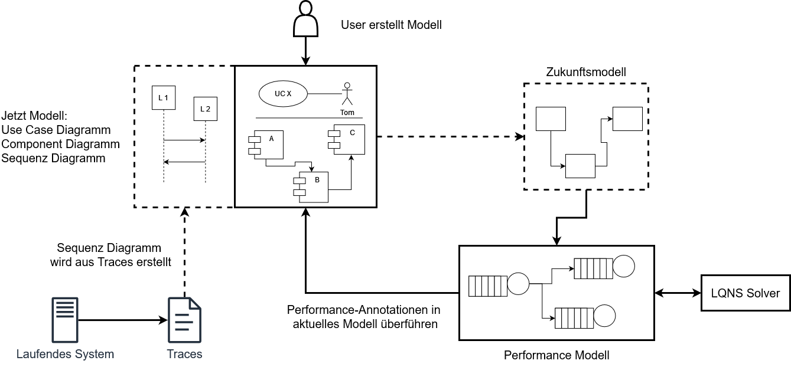

# MasterThesisExamples
Different Examples which are required to develop and run my master thesis.

The following picture gives a short overview what is expected in my thesis:


The dotted lines are the contributions which are inteded by me, 
other parts have already been implemented.
However, I have to create data to be able to work on my parts.


# Used Tools

In this repository different setups are present depending on the setup different tools are required.
This section will provide basic information on the tools. 

For the analysis of the created traces the Kieker tools are required, especially the [trace-analysis](https://kieker-monitoring.readthedocs.io/en/latest/kieker-tools/Trace-Analysis-Tool.html#kieker-tools-trace-analysis-tool) tool.

## System

Since different systems act differently I hereby disclose my setup, 
if commands do not work with your system, please refere to the respective documentation.

System: Windows 10 and 11 \
Runtime Environment: [WSL2](https://learn.microsoft.com/en-us/windows/wsl/about) \
Preferred development IDE: [intelliJ IDEA](https://www.jetbrains.com/idea/) 

## Docker

````bash
docker version
````
See output for my system in [docker-version](documentation/docker-version.md)

Docker is a tool to have a fixed environment for the runtime of an application.
To install docker, please refer to the [documentation](https://docs.docker.com/get-docker/) on how to achieve this on your system.

Docker comes with a tool to create complex services the `compose` tool, to enact it run: 
```bash
docker compose up 
```
This command requires that a `docker-compose.yml` file is present in the folder you run the command.

Alternatively, it is possible to reference a specific file with the `-f` flag:
```bash
docker compose -f compose/docker-compose.yml up
```

To stop the service again press the `STRG` + `C` keys simultaneously.

If you want to run the **service in the background** (detached) run the following command with the `-d` flag at the end:
```bash
docker compose -f compose/docker-compose.yml up -d
```

To **stop the service again** when it is detached run the following:
```bash
docker compose -f compose/docker-compose.yml down
```

To get information on what services are up, run the following:
```bash
docker compose ps
```

All commands are pretty basic and can easily be found out when using the search engine of your choise.
There might also be alterations which are useful which are not mentioned here.

## Kieker

TODO

