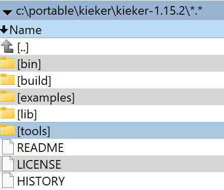

# Trace Analysis

`trace-analysis` is a tool that is provided by the [kieker](https://github.com/kieker-monitoring/kieker/) project.
It is provided when [downloading the binaries](https://kieker-monitoring.net/download/) for kieker.

## Installation

For this installation description is tested in the Ubuntu WSL (sources: [Ubuntu](https://ubuntu.com/wsl), [Windows](`https://learn.microsoft.com/de-de/windows/wsl/install`)) environment.
The kieker version used is ``1.15.2``, it is required to have the binaries unpacked, this might look like this:



To install the `trace-analysis` go into the `tools` folder and unpack the `trace-analysis-1.15.2.zip` file.
This can be done executing the command `unzip trace-analysis-gui-1.15.2.zip`.

Go to your home directory with `cd ~` and create the `bin` folder with `mkdir bin` and change into the directory with `cd bin`

In the bin directory we can put scripts that can be executed by the shell in a standard manner.
The `trace-analysis` tool already provides the script, we only have to create a symbolic link file within the `bin` directory.
To do this execute the following command:
````bash
ln -s /mnt/c/portable/kieker/kieker-1.15.2/tools/trace-analysis-1.15.2/bin/trace-analysis trace-analysis
````
The first parameter is the original file, in this case an absolute path to the script is given.
The second parameter is to give the path to the symbolic link file, since we are already in the required directory it can be created within the ``bin`` folder directly.
Please make sure that the paths are correct.

When all steps are executed correctly the tool can be called from within the shell with `trace-analysis`

## Outputs
There are different outputs that provide views on the system that has been probed.
There are two general output formats `.dot` and `.pic`.
The [dot dsl](https://www.graphviz.org/doc/info/lang.html) is there to model graphs.
With the [pic dsl](https://en.wikipedia.org/wiki/PIC_(markup_language)) line diagrams can be depicted like sequence diagrams.

The ``dot`` tool is described [here](../dot_langiage/DotLanguage.md) and is able to transform `.dot` files into human-readable outputs.

The ``pic2plot`` tool is described [here](https://www.gnu.org/software/plotutils/manual/en/html_node/pic2plot-Introduction.html)
is part of the gnu ``plotutils`` and is able to transform `.pic` files into human-readable outputs.

## Usage

To find the commands that can be executed please check the [documentation](https://kieker-monitoring.readthedocs.io/en/latest/kieker-tools/Trace-Analysis-Tool.html#kieker-tools-trace-analysis-tool)
or in the parameter class of the kieker project [TraceAnalysisParameters](https://github.com/kieker-monitoring/kieker/blob/master/kieker-tools/trace-analysis/src/kieker/tools/trace/analysis/TraceAnalysisParameters.java).

To print the help about the possible parameters simply run (this might take quite some time until an output is produced):
````bash
trace-analysis
````

Create call tree `.dot` files out of traces:
```bash
trace-analysis --inputdirs ./kieker-monitoring/teastore-*/kieker* -o ./output/dot --plot-Call-Trees
```

Explanation:
- `--inputdirs ./kieker-monitoring/teastore-*/kieker*` provides the directories to which the trace logs haven been written. In this command the `*` operator (similar to any) is used to create the set of directories which happen to be filled with Kieker traces.
- `-o ./output` is the directory to which the output is written. If the directory does not exist the trace-analyse tool will fail.
- `--plot-Call-Trees` this is tells the tool to create call trees in `.dot` notation.

Create component dependency graphs `.dot` files out of traces:
```bash
trace-analysis --inputdirs ./kieker-monitoring/teastore-*/kieker* -o ./output --plot-Assembly-Component-Dependency-Graph true
```
Only the `assemblyComponentDependencyGraph.out.svg` file is created in the output directory.

Explanation:

- `--plot-Assembly-Component-Dependency-Graph true` tells the tool to create the output, `true` is required since an input is expected and default is false.

