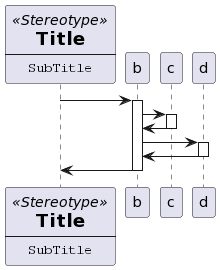

# Uml2Text Transformation

This module describes the transforamtion of the UML model to PlantUML syntax.
The EGL (Epsilon code Generation Language) scripts transforms the model to the PlantUML syntax.
Provided are Sequence, Component, Deployment, and Class views. 
EGL is a language in the Epsilon ecosystem and leverages the EOL (Epsilon Object Language).
The EOL is the foundation within the Epsilon ecosystem, and is used in every language within the system.
The EGL is a templating language that allows to create text out of the model provided.

PlantUML has a simplified syntax to create UML diagrams.
It allows to create different file formats that show the respective diagrams, like PNG org SVG.
An example of the syntax is provided within the File SequenceDiagram.txt.
The following diagram resembles the diagram:

PlantUML is based on GraphViz.
The documentation for the syntax is here:
https://plantuml.com/

An Editor is also provided here:
https://www.plantuml.com/plantuml/uml/